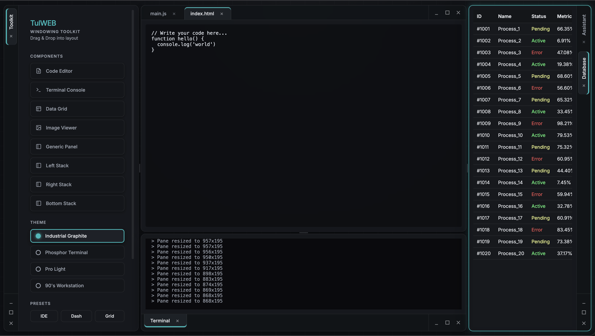

# TulWEB - Pure JS Windowing Toolkit

> [!IMPORTANT]
> This project is currently in an experimental phase. It is not recommended for production environments and may contain architectural inconsistencies.

TulWEB is a modular windowing toolkit implemented in vanilla JavaScript, designed for constructing complex tiling and stacking layouts in web applications. It provides a core `LayoutManager` for managing nested rows, columns, and tab stacks with support for interface interactions, resizable splitters, and theme synchronization.

 


## Core Capabilities

- **Configurable Tab Orientation**: Support for Top, Bottom, Left, and Right tab placements per stack.
- **Stack Minimization**: Capability to collapse stacks to their tab headers with asynchronous component previews.
- **Geometric Constraints**: Support for `size`, `minWidth`, and `minHeight` using CSS units (e.g., `"300px"`, `"20%"`) to maintain layout usability. Constraints are dynamically bypassed during stack minimization.
- **Automated Verification**: Integrated E2E testing using Playwright and unit testing via Jest to ensure stability across browser environments.
- **Zero Dependencies**: Core implementation relies exclusively on native JavaScript APIs.
- **Nested Layout Architectures**: Support for recursive row and column nesting for complex interface requirements.
- **Component Stacking**: Logical grouping of components into stacks with overflow management.
- **Interactive Drag & Drop**: Native-aligned interaction model for tab reordering and panel splitting.
- **Proportional Resizing**: Flexbox-based layout engine with resizable splitters.
- **Theme System**: Pre-configured design systems including Industrial Graphite, Phosphor Terminal, Pro Light, and Retro 90s, utilizing modern CSS properties for interface depth.
- **State Persistence**: Full layout state serialization and restoration via JSON schema.
- **Exposed Event API**: Internal `EventEmitter` system for lifecycle hook integration (`init`, `active`, `focus`, `resize`, etc.).
- **Accessibility Compliance**: ARIA role implementation and keyboard navigation support.
- **Memory Management**: Optimized garbage collection and per-instance interaction handling.
- **ES6 Architecture**: Internal implementation utilizing ES6 classes for modularity.

## Installation

Simply include the CSS and JS files in your project:

```html
<!-- Option 1: Direct File Usage -->
<link rel="stylesheet" href="tulweb.css">
<script type="module">
  import { LayoutManager } from './tulweb.js';
  const layout = new LayoutManager(null, document.body);
</script>

<!-- Option 2: NPM Installation -->
<!-- npm install tulweb -->
```

## Local Development

To run the documentation and demo locally, use the following commands:

```bash
npm install
npm start
```

### Static Build

To generate a single, self-contained HTML file of the documentation (inlining all CSS and JS), run:

```bash
npm run bundle-docs
```

This will create `docs-bundle.html` and `index-bundle.html` in the root directory.

## Automated Testing

TulWEB includes a comprehensive testing suite to ensure reliability and performance.

### E2E Testing (Playwright)

Run end-to-end tests in a real browser:
```bash
npm test
```

To open the interactive Playwright UI for debugging:
```bash
npm run test:ui
```

### Unit Testing (Jest)

Run core logic unit tests:
```bash
npm run test:unit
```

## Quick Start

### 1. Initialize the Layout Manager

Create a container in your HTML and initialize the `LayoutManager`. You can pass an optional settings object to govern behavior.

```javascript
import { LayoutManager } from './tulweb.js';

const container = document.getElementById("layout-container");
const layout = new LayoutManager(null, container, {
    onlyResizeActiveTabs: true // (Default) Only dynamically visible tabs process resize geometry
});
```

### 2. Register Your Components

Define factory functions that return DOM elements and register them with the toolkit.

```javascript
layout.registerComponent('editor', (state, container) => {
    const el = document.createElement("textarea");
    el.value = state.text || "// Hello World";
    return el;
});

// OR use a Class
class MyComponent {
    constructor(state, container) {
        this.element = document.createElement("div");
        this.element.textContent = "Class-based Component";
    }
}
layout.registerComponent('my-comp', MyComponent);
```

### 3. Load a Layout

Load a layout configuration to populate the workspace.

```javascript
const initialLayout = {
    content: [{
        type: 'row',
        content: [
            {
                type: 'stack',
                size: 30,
                content: [{ type: 'component', componentName: 'editor', title: 'File 1' }]
            },
            {
                type: 'stack',
                size: 70,
                content: [{ type: 'component', componentName: 'editor', title: 'File 2' }]
            }
        ]
    }]
};

layout.loadLayout(initialLayout);
```

## Creating Drag Sources

Turn any existing DOM element into a drag source to add new components to the workspace.

```javascript
const myButton = document.querySelector('.add-btn');
const config = { type: 'component', componentName: 'editor', title: 'New Document' };

layout.createDragSource(myButton, config);
```

## Component Lifecycle Events

TulWEB uses an internal `EventEmitter` system that allows you to hook directly into layout state changes. You can bind to these events directly on the `container` instance passed to your component factories:

- `init`: Fired once the factory binds the DOM and mounts the component.
- `active`: Fired when an inactive component becomes the visible tab in its stack.
- `inactive`: Fired when a component is hidden behind a newly selected active tab.
- `focus`: Fired when the component is the active tab **and** its parent stack receives user focus.
- `defocus`: Fired when the component loses focus (either by becoming inactive, or the focus shifting to another stack).
- `move`: Fired right after a component acts as a dragged tab and successfully drops into a new layout position.
- `resize`: Fired when a splitter is dragged, parent container changes size, or browser window resizes.
- `destroy`: Fired immediately before garbage collection.

## Themes

Apply themes by setting the class on the `<body>` element:
- `theme-nordic` (Industrial Graphite)
- `theme-cyber` (Phosphor Terminal)
- `theme-light` (Pro Light)
- `theme-retro` (90's Workstation/IRIX)

## Licensing

TulWEB is licensed under the [MIT License](LICENSE).
- No incompatible third-party components.
- Standard MIT permissions for commercial and personal use.

---

Developed with a focus on high-performance windowing logic and interface responsiveness.
